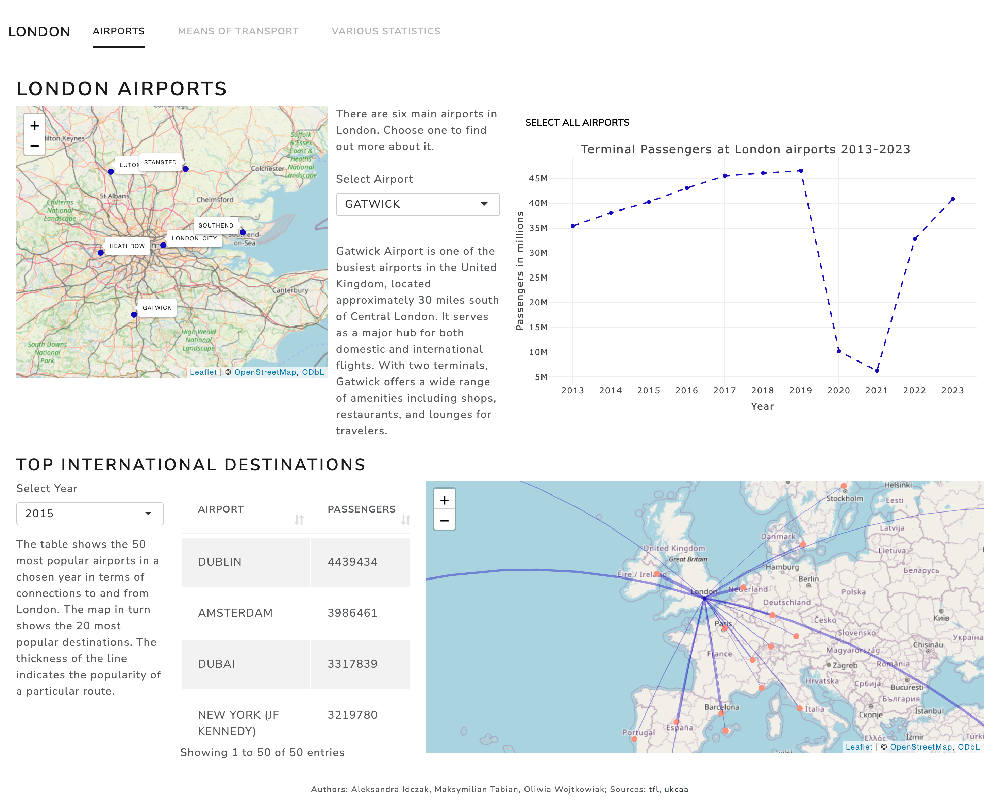
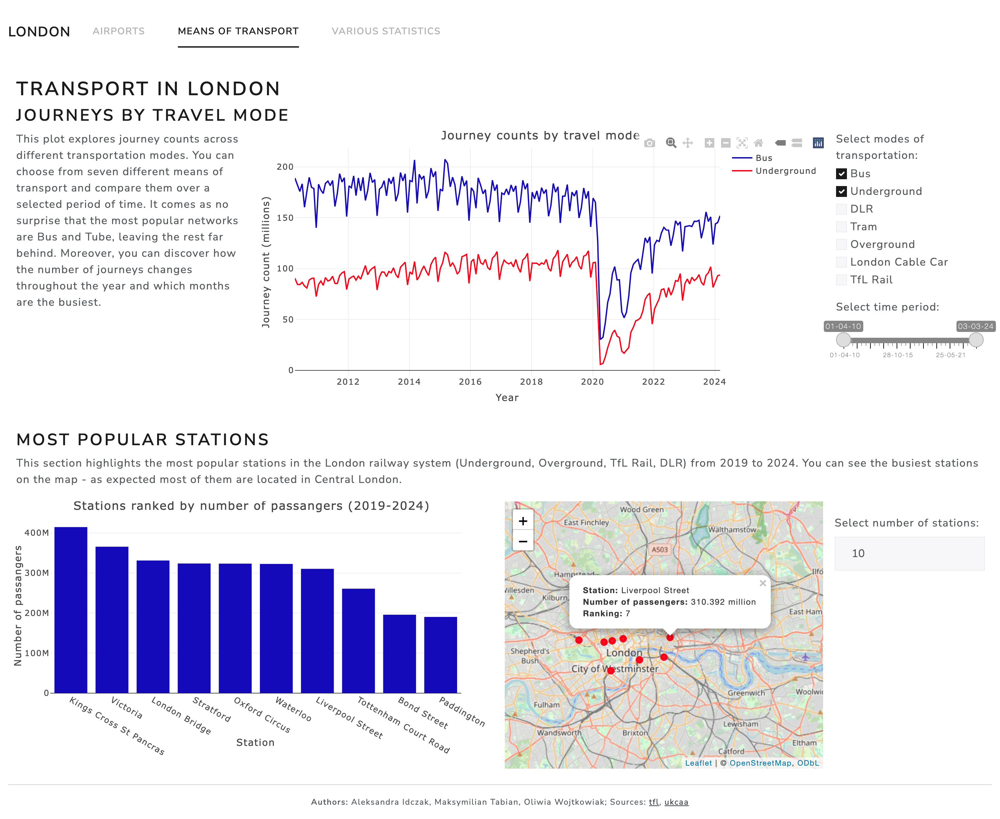

# Aplikacja o transporcie lotniczym i komunikacji miejskiej w Londynie
## Autorzy: Oliwia Wojtkowiak, Maksymilian Tabian, Aleksandra Idczak

Źródła danych: [Transport for London](https://tfl.gov.uk/info-for/open-data-users/our-open-data), [UK Civil Aviation Authority](https://www.caa.co.uk/data-and-analysis/uk-aviation-market/airports/uk-airport-data/)

Wszystkie ramki danych, potrzebne do wygenerowania wykresów znajdują się w repozytorium ([link](https://github.com/olaidczak/projekt-2)).

Aplikacja zawiera trzy zakładki:
* Airports
* Means of transport
* Various statistics

## Wygląd aplikacji
### Zakładka Airports
Zakładka Airports zawiera informacje dotyczące lotnisk w Londynie oraz najpopularniejszych międzynarodowych destynacji.

Mapa Lotnisk w Londynie:

Na mapie zaznaczone są główne lotniska Londynu: Heathrow, Gatwick, Stansted, Luton, London City, i Southend.
Po lewej stronie znajduje się rozwijane menu, które pozwala wybrać jedno z lotnisk, aby uzyskać szczegółowe informacje na jego temat. W przykładzie wybrano lotnisko Gatwick.
Po prawej stronie znajduje się wykres przedstawiający liczbę pasażerów na danym lotnisku w latach 2013-2023. Jest też opcja wyświetlenia wszystkich lotnisk na raz .

Najpopularniejsze Międzynarodowe Destynacje:

U dołu strony znajduje się tabela pokazująca 50 najpopularniejszych międzynarodowych lotnisk w wybranym roku pod względem liczby pasażerów podróżujących z i do Londynu. Wybrano rok 2015.
Obok tabeli znajduje się mapa z zaznaczonymi 20 najpopularniejszymi trasami lotniczymi z tabeli, gdzie grubość linii wskazuje na popularność danej trasy.

### Zakładka Means of transport
Zakładka Means of transport zawiera dwie sekcje. W pierwszej z nich możemy porównać popularność różnych 
środków transportu (m.in metro, autobusy, pociągi DLR, tramwaje) na wybranym przez nas przedziale czasowym.

Druga część zawiera wykres, ktory przedstawia najstacje (metra, kolejki naziemnej, koleji DLR i koleji TfL), 
które obsłużyły największą ilość pasażerów. Dodatkowo możemy wybrać ich ilość oraz sprawdzić ich lokalizację na mapie. 

### Zakładka Various statistics
Zakładka Various statistics zawiera trzy wykresy, każdy dotyczy innego londyńskiego środka transportu. Pierwszy z nich ukazuje ilość przejazdów autobusami miejskimi w różnych strefach. Kolejny wykres przedstawia ilość wypożyczonych rowerów w kolejnych miesiącach dla wybranych przez użytkownika lat. Ostatnia grafika demonstruje zależność pomiędzy poszczególnymi stacjami metra a panującymi w nich temperaturami.

